# Gestión de Usuarios
### Creación de usuarios:
```sudo useradd usuario1```  
```sudo useradd usuario1```  
```sudo useradd usuario1```

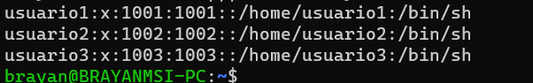

### Asignación de Contraseñas
```sudo passwd usuario1```  
```sudo passwd usuario1```  
```sudo passwd usuario1```

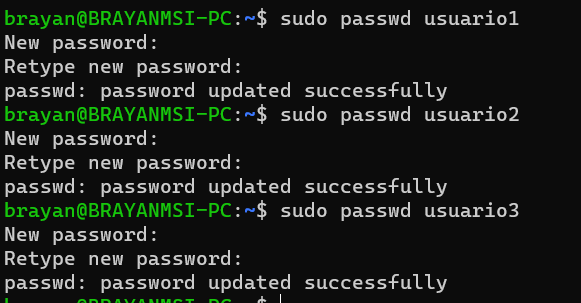

### Información de Usuarios
```id usuario1``` 

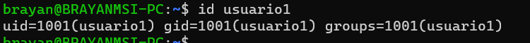

### Eliminación de Usuarios
```sudo userdel usuario3``` 

# Gestión de Grupos
### Creación de Grupos
```sudo groupadd grupo1```   
```sudo groupadd grupo2```   

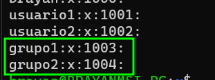

### Agregar Usuarios a Grupos
```sudo gpasswd -a usuario1 grupo1```   
```sudo gpasswd -a usuario2 grupo2```  

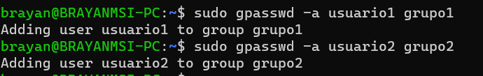

### Verificar Membresía
```groups usuario1```   
```groups usuario1``` 

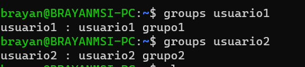

### Eliminar grupo
```sudo groupdel grupo2```  

# Gestión de Permisos
### Creación de Archivos y Directorios
```
su - usuario1
cat > archivo.txt
mkdir directorio1
cd directorio1
cat > archivo2.txt
```   

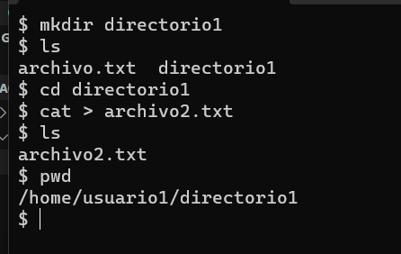

### Verificar Permisos
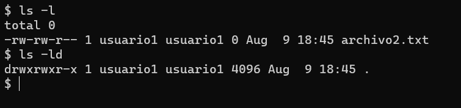

### Modificar Permisos usando chmod con Modo Numérico
```chmod 540 archivo1.txt```

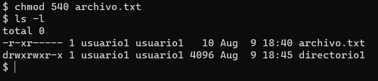

### Modificar Permisos usando chmod con Modo Simbólico
```chmod u+x archivo2.txt```   

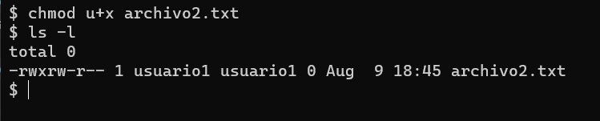

### Cambiar el Grupo Propietario
```chgrp grupo1 archivo2.txt```

### Cambiar el Grupo Propietario
```chmod 740 directorio1```

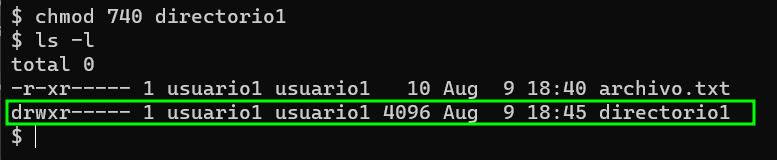

### Comprobación de Acceso
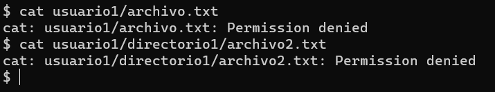

### Verificación Final
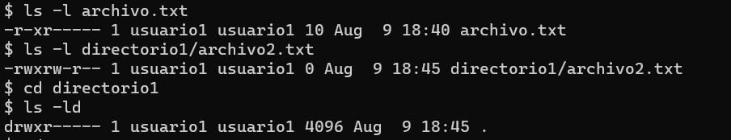